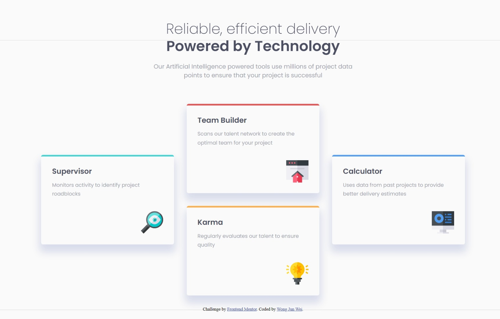
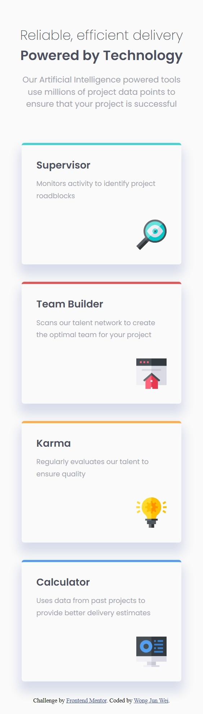

# Frontend Mentor - Four card feature section solution

This is a solution to the [Four card feature section challenge on Frontend Mentor](https://www.frontendmentor.io/challenges/four-card-feature-section-weK1eFYK). Frontend Mentor challenges help you improve your coding skills by building realistic projects. 

## Table of contents

- [Overview](#overview)
  - [The challenge](#the-challenge)
  - [Screenshot](#screenshot)
  - [Links](#links)
- [My process](#my-process)
  - [Built with](#built-with)
  - [What I learned](#what-i-learned)
  - [Useful resources](#useful-resources)

**Note: Delete this note and update the table of contents based on what sections you keep.**

## Overview

### The challenge

Users should be able to:

- View the optimal layout for the site depending on their device's screen size

### Screenshot




### Links

- Solution URL: [https://www.frontendmentor.io/solutions/responsive-with-sass-flexbox-and-grid-caT_yUWQDJ](https://www.frontendmentor.io/solutions/responsive-with-sass-flexbox-and-grid-caT_yUWQDJ)
- Live Site URL: [https://junwei-wong.github.io/four-card-feature-section-master/](https://junwei-wong.github.io/four-card-feature-section-master/)

## My process

### Built with

- Semantic HTML5 markup
- Flexbox
- CSS Grid
- Mobile-first workflow

**Note: These are just examples. Delete this note and replace the list above with your own choices**

### What I learned

- Using flex and grid together.

```css
section#cards {
      display: grid;
      grid-template: 1fr / 1fr 1fr 1fr;
    }
```
```css
section#cards {
    display: flex;
    align-items: center;
    flex-direction: column;
    margin-top: 1.5rem;
  }
```

### Useful resources

- [Flexbox Frogger](https://flexboxfroggy.com/) - This helped me to learn about flexbox using gamification.
- [Grid Garden](https://cssgridgarden.com/) - This helped me to learn about grid using gamification.

